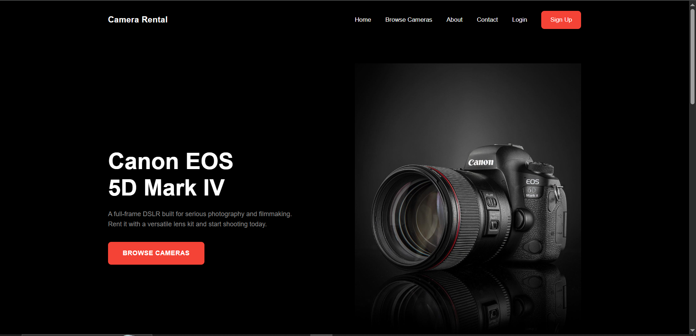
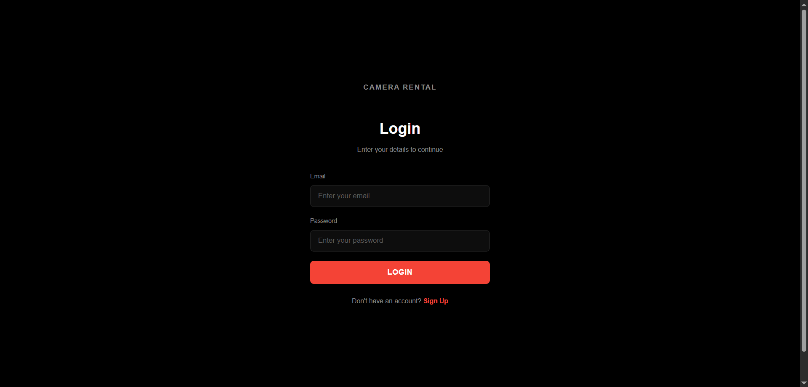
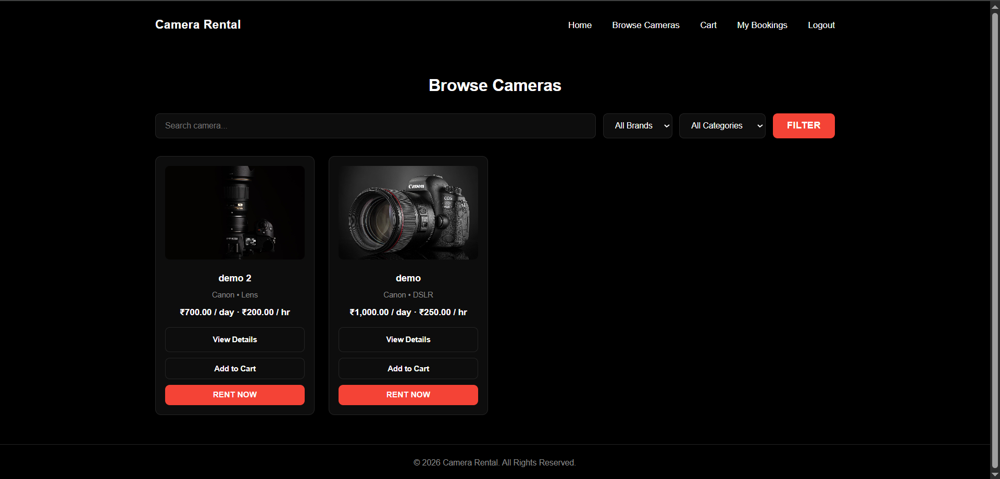
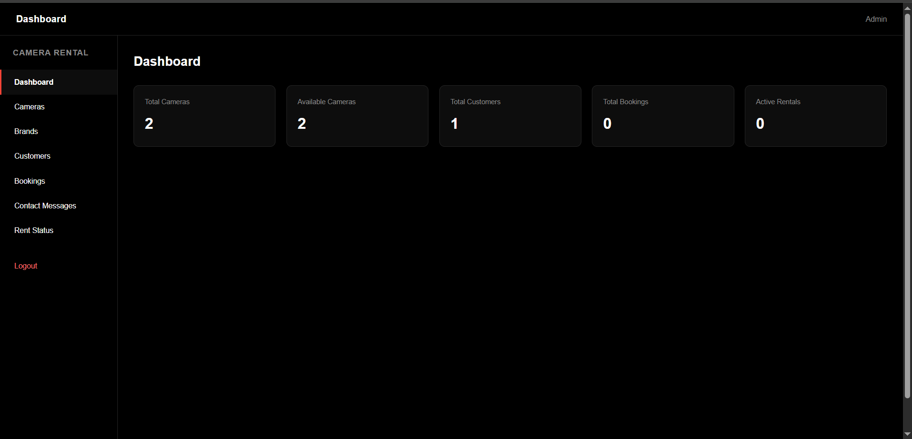

# CameraHub — Online Camera Rental System

A full-stack camera rental web application built with **PHP, MySQL (MySQLi), and vanilla HTML/CSS/JS** — no frameworks, no Composer, no external libraries. Built as a college project targeting PHP 5.x / WAMP 5.x compatibility.

**Live Demo:** [https://camerahub.free.je/](https://camerahub.free.je/)

---

## Features

### User Side
- Browse and search available cameras by brand/category
- Add cameras to cart, manage quantities
- Book cameras with pickup/return dates
- View booking history and status
- Contact form

### Admin Side
- Dashboard with rental stats (total cameras, customers, bookings, active rentals)
- Manage cameras, brands, and categories (add/edit/delete)
- Manage customers and view customer details
- Manage bookings and update booking status
- Track active, returned, and cancelled rentals

---

## Screenshots

**Homepage**


**Login**


**Browse Cameras**


**Admin Dashboard**


---

## Tech Stack

- **Backend:** PHP (5.x compatible), MySQLi (procedural)
- **Database:** MySQL
- **Frontend:** HTML5, CSS3, Vanilla JavaScript
- **Server:** Apache (WAMP)

No frameworks, no Composer, no jQuery/Bootstrap/React — built entirely with core web technologies.

---

## Project Structure

```
camera-rental-system/
├── admin/          → Admin panel (dashboard, camera/brand/booking management)
├── user/           → Customer-facing pages (browse, cart, bookings)
├── includes/       → Shared PHP (db connection, session, auth, header/footer)
├── assets/         → CSS, JS, images, uploads
├── database/       → camera_rental.sql
├── index.php       → Public homepage
├── login.php       → Shared login (user/admin)
├── signup.php      → Customer registration
└── logout.php      → Session destroy
```

---

## Installation

1. Clone/download this repository into your WAMP `www` directory.
2. Import `database/camera_rental.sql` into MySQL (via phpMyAdmin or CLI).
3. Update DB credentials in `includes/config.php` if needed.
4. Start Apache & MySQL via WAMP.
5. Visit `http://localhost/camera-rental-system/`.

**Default Admin Login**
- Email: `admin@gmail.com`
- Password: `admin123`

---

## Security Notes

- All queries use prepared statements (MySQLi).
- Output escaped with `htmlspecialchars()`.
- Sessions used for authentication; admin/user routes protected.

---

## License

This project was built for educational purposes as a college submission.